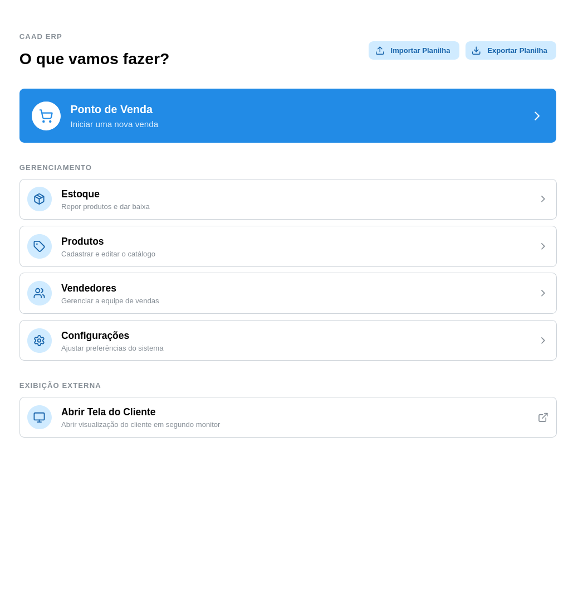
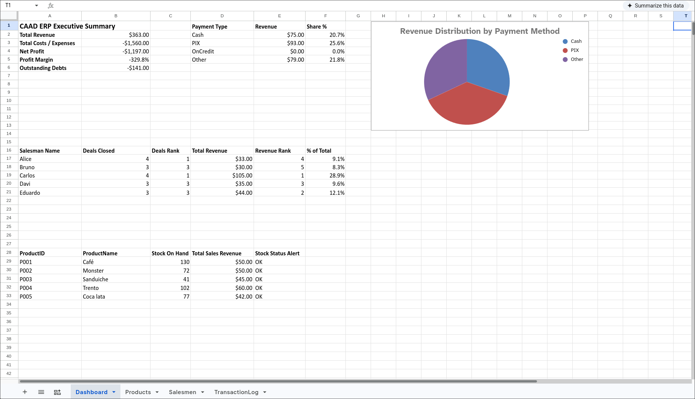

# CAAD ERP

> Excel-backed inventory, sales tracker, and web point-of-sale system for
> student lounges.




## Motivation

When managing inventory, sales, and tab debts, student lounges had to rely on
over-engineered POS systems or overly simple Excel sheets.

To solve this, I built **CAAD ERP**, a simple inventory and sales management
system specifically tailored for student lounge operations.

The project pairs Python business logic and a modern React web interface with an
Excel-based "source of truth" so non-technical managers can trust the data and
analyze it with the tools they already know.

---

## Key Features

### Web Application (Frontend)

- **Point of Sale (POS):** Interactive cart and checkout flow, salesman
  selection screen, and payment confirmation (including Mercado Pago PIX QR
  codes).
- **Customer Display Mode:** Separate customer-facing display view for checkout
  transparency.
- **Product Management:** Tools to add, edit, or remove items from the catalog.
- **Salesmen Management:** Register, update, and toggle active status of
  salespeople.
- **Stock Management:** Direct control over inventory levels with restock and
  write-off modal workflows.

### Backend & Core Ledger

- **Append-only Transaction Ledger:** `TransactionLog` guarantees an auditable,
  immutable history.
- **Excel Source of Truth:** OpenPyXL integration using locked Excel workbooks
  for transparent record-keeping.
- **FastAPI REST Server:** Headless HTTP API with OpenAPI schema support for
  local network operation.
- **Interactive CLI & REPL:** Console tool with a built-in REPL mode for fast
  interactive terminal management.

---

## Quick Start & Installation

### Prerequisites

- **Python 3.12+** and [`uv`](https://docs.astral.sh/uv/)
- **Node.js 18+** and `npm`

### 1. Clone & Install Dependencies

```bash
git clone https://github.com/Davi-S/caad-erp.git
cd caad-erp

# Install root orchestration tools (concurrently)
npm install

# Setup backend Python environment
cd backend
uv venv
source .venv/bin/activate
uv pip install -e ".[api,test]"
cd ..

# Setup frontend Node environment
cd frontend
npm install
cd ..
```

### 2. Excel Workbook

The repository comes pre-packaged with a clean, initialized Excel workbook at `backend/master_workbook.xlsx`. No additional initialization step is required to run the application.

> **Optional (Reset Workbook):** If you ever need to reset or re-create a blank master workbook, run:
> ```bash
> cd backend
> uv run setup_excel.py --force
> cd ..
> ```

---

## Development & Running the Application

### Production / Unified Single-Process Mode

To run the complete application in production or local network mode using a single process:

```bash
# Build production frontend assets
npm run build:frontend

# Start full unified app (http://0.0.0.0:8000)
npm start
# or: cd backend && uv run caad-erp
```

### Development Mode

To run both services concurrently with hot-reloading:

```bash
# Launch FastAPI backend (http://0.0.0.0:8000) and Vite frontend (http://0.0.0.0:5173)
npm run dev
```

### Run Services Individually

```bash
# Start backend API server only (no static frontend)
npm run dev:backend

# Start frontend Vite server only
npm run dev:frontend
```

---

## Roadmap & Future Enhancements

- **Log Audit & Void UI:** Web UI capabilities to review transaction logs and
  void entries directly.
- **Analytics & Reports Dashboard:** Visual analytics for profit margins, sales
  summaries, and debt tracking.
- **FastAPI Static File Serving:** [COMPLETED] Option to bundle and serve static frontend
  assets directly from FastAPI (`caad-erp`) for single-process local deployment.

---

## Contributing & Documentation

Contributions are welcome! Please check the following resources:

- [CONTRIBUTING.md](./CONTRIBUTING.md) - Workflow and code style conventions.
- [Developer Guide](./docs/DEVELOPER_GUIDE.md) - Monorepo architecture, testing
  workflows, offline API codegen, and system design.

