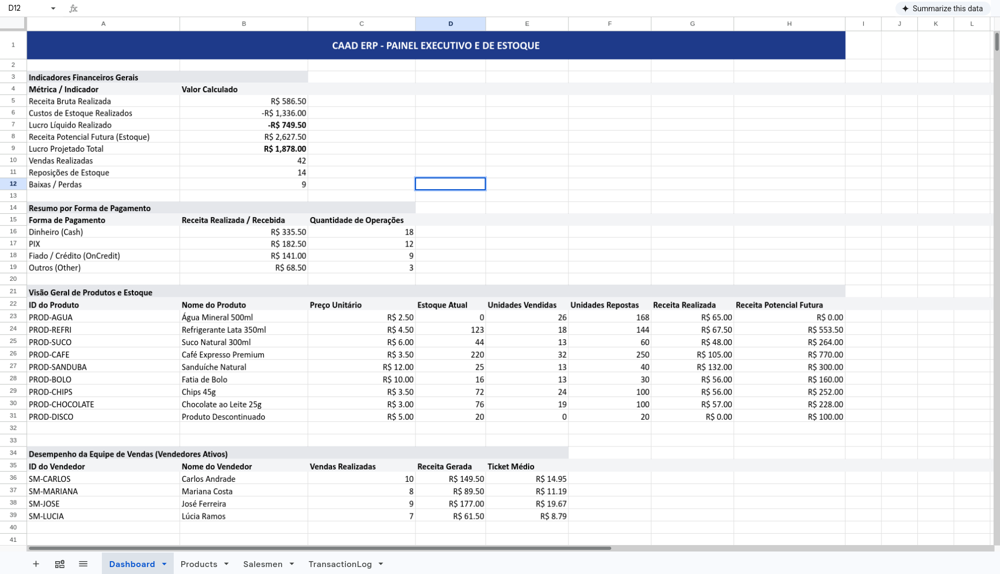

# CAAD ERP

> Excel-backed inventory, sales tracker, and web point-of-sale system for
> student lounges.




## Motivation

When managing inventory, sales, and tab debts, student lounges had to rely on
over-engineered commercial POS systems or fragile spreadsheet setups.

To solve this, **CAAD ERP** provides a lightweight, highly responsive inventory
and sales management system specifically tailored for student lounge operations.

Built as a **100% end-to-end TypeScript monorepo**, CAAD ERP combines a Node.js
backend (SQLite + Drizzle ORM + tRPC) with a modern React web interface
(Mantine + Vite + React Query).

---

## Key Features

### Web Application (Frontend)

- **Point of Sale (POS):** Interactive cart and checkout flow, salesman
  selection screen, and payment confirmation (including Mercado Pago PIX QR
  codes).
- **Customer Display Mode:** Dedicated customer-facing display view for
  real-time checkout transparency.
- **Product Management:** Tools to add, edit, or toggle active status of items
  in the catalog.
- **Salesmen Management:** Register, update, and manage salespeople.
- **Stock Management:** Direct control over inventory levels with restock and
  write-off modal workflows.

### Backend and Core Ledger

- **Append-only Transaction Ledger:** SQLite-backed immutable transaction log
  providing a complete, auditable history of all sales, restocks, write-offs,
  credit payments, and reversals.
- **Excel Support:** Can import and export the data to an Excel file for easily
  auditing using known software.
- **Zero-Config Portable Storage:** High-performance in-process SQLite database
  (`better-sqlite3`) requiring zero database server setup or maintenance.

---

## Installation and Running the application

### Prerequisites

- **Node.js 18+** and `npm`

---

### Manual Installation

#### 1. Clone and Install Workspace Dependencies

```bash
git clone https://github.com/Davi-S/caad-erp.git
cd caad-erp

# Install and link all npm workspace dependencies (backend and frontend)
npm install
```

---

### Running the application

To build and run the full application in production mode:

```bash
# Start unified server
npm run start
```

---

## Contributing and Documentation

Please check the following documentation resources:

- [Developer Guide](./docs/DEVELOPER_GUIDE.md)
- [Workflows](./docs/WORKFLOWS.md)
- [User Guide](./docs/USER_GUIDE.md)
