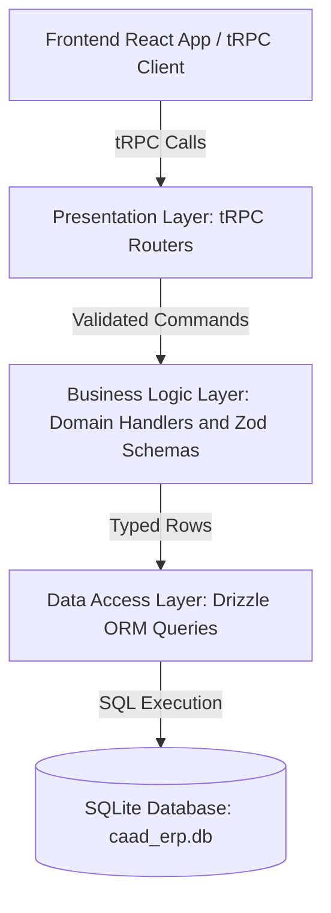

# Developer Guide

This guide captures the internal architecture decisions, design principles,
system rationale, and development workflows for the CAAD ERP project. It serves
as the primary technical reference for developers maintaining or extending the
codebase.

> For complete user-facing and operational guides detailing how all features
> work (POS checkouts, credit tabs, restocks, write-offs, voids, etc.), refer to
> the [User and System Workflows Guide](./WORKFLOWS.md).

---

## System Overview and Guiding Principles

CAAD ERP is an end-to-end full-stack TypeScript application designed for student
lounge operations, managing point-of-sale checkouts, product catalogs,
salespeople, inventory levels, credit tab tracking, and financial analytics.

The system is built around several core architectural principles:

- **Immutability and Auditability:** All financial and stock events are recorded
  in an append-only transaction ledger. Data is never deleted or overwritten in
  place, guaranteeing a complete audit trail.
- **End-to-End Type Safety:** Strict static typing spans from database tables
  (Drizzle ORM) through service contracts (tRPC) directly into React UI
  components and hooks without manual code generation.
- **Zero-Configuration Local Deployment:** The application runs embedded without
  external database processes, making installation, backups, and local network
  execution straightforward.
- **Pure Layering and Separation of Concerns:** Core domain rules are decoupled
  from presentation concerns and data storage drivers, keeping logic testable
  and predictable.

---

## Monorepo Architecture

The project is structured as an npm Workspaces Monorepo separating the backend
server and frontend web consumer while sharing tooling and configuration at the
root:

```text
caad-erp/
├── backend/            # Backend Workspace (Node.js + Drizzle ORM + SQLite + tRPC)
│   ├── src/
│   │   ├── dal/        # Data Access Layer (Schema definitions and SQLite queries)
│   │   ├── bll/        # Business Logic Layer (Colocated Zod schemas and domain logic)
│   │   ├── trpc/       # Presentation Layer (tRPC routers, context, & standalone HTTP server)
│   └── tests/          # Vitest suite (DAL, BLL, tRPC integration tests)
├── frontend/           # Frontend Workspace (React 19 + Vite + Mantine + React Query)
│   ├── src/            # Features (POS, Stock, Salesmen, Home), components, and hooks
│   ├── tests/          # Vitest suite (Discount calculation & allocation tests)
│   └── package.json    # Frontend package definition
├── docs/               # Technical specifications, developer guide, and workflows
│   ├── DEVELOPER_GUIDE.md # Technical architecture and design rationale
│   └── WORKFLOWS.md       # Complete user and system operations guide
├── package.json        # Root npm Workspaces orchestration and shared scripts
├── .oxlintrc.json      # Shared monorepo linting rules
├── .oxfmtrc.json      # Shared monorepo code formatting rules
└── start.bat           # Windows 1-click launch and setup script
```

---

## Running the application in Development Mode

To launch both the backend tRPC server (Port 8000) and frontend Vite dev server
(Port 5173) with hot-reloading:

```bash
npm run dev
```

## Run Workspace Commands Individually

```bash
# Start backend TypeScript compiler in watch mode
npm run dev:backend

# Start frontend Vite server only
npm run dev:frontend

# Run full Vitest test suite across backend and frontend (143+ unit and integration tests)
npm test

# Lint and format all monorepo files (Oxlint and Oxfmt)
npm run fix
```

## Architectural Rationale and High-Level Decisions

### Embedded Relational Database (SQLite + `better-sqlite3`)

The backend uses SQLite via native C++ bindings (`better-sqlite3`) rather than
an external database server like PostgreSQL or MySQL.

- **Zero-Config Execution:** Eliminates administrative overhead (no background
  database daemon, user permissions, or port configurations required).
- **Single-File Portability:** All application state is stored in a single
  portable file (`caad_erp.db`), simplifying backups and migration.

### Explicit Schema Design (Drizzle ORM)

Drizzle ORM provides lightweight, type-safe SQL query generation without runtime
abstraction overhead.

- **Explicit Constraints over Fallbacks:** Non-null columns are declared without
  implicit default fallbacks. Creation functions require callers to explicitly
  supply all attributes, preventing silent data fallbacks.

### End-to-End Contract Typing (tRPC)

The presentation layer uses tRPC (`@trpc/server` and `@trpc/react-query`) to
link backend handlers to the React frontend.

- **Compile-Time Type Sharing:** The frontend imports the backend router type
  definition directly (`import type { AppRouter } from 'caad-erp-backend'`),
  giving UI components instant autocompletion and type checking for procedure
  inputs and outputs without running build steps or OpenAPI codegen tools.
- **Automatic Error Translation:** Domain exceptions thrown in the business
  logic layer are intercepted by tRPC middleware and mapped automatically to
  semantic HTTP error statuses (such as mapping missing entities to `NOT_FOUND`
  or stock shortages to `BAD_REQUEST`).

### UI Framework and State Management (React + Mantine + React Query)

The frontend uses React 19, Vite, Mantine UI components, and TanStack React
Query.

---

## Layered System Architecture

The backend follows a 3-layer architecture:



### Data Access Layer (DAL)

The Data Access Layer (`backend/src/dal/`) contains pure SQL query functions.
Every DAL function accepts an active database client instance as its first
argument, keeping functions stateless and side-effect-free.

### Business Logic Layer (BLL)

The Business Logic Layer (`backend/src/bll/`) encapsulates business rules,
analytics calculations, and validation logic.

- **Two-Tier Validation Strategy:** Validation is split into two complementary
  phases:
    - _Stateless Boundary Validation:_ Zod schemas validate structural types,
      string length, and numeric bounds synchronously before reaching domain
      handlers.
    - _Stateful Invariant Enforcement:_ Domain handlers enforce database-dependent
      rules (such as checking stock availability, active flags, or credit line
      links).

### Presentation Layer (tRPC Routers)

The Presentation Layer (`backend/src/trpc/`) exposes procedures for feature
modules (`products`, `salesmen`, `transactions`, `reports`). It constructs
context containing the active database client and routes validated inputs into
BLL handlers.

---

## Data Model and Column Representation Conventions

### Relational Tables

- **`products` Table:** Stores catalog items with `product_id` (text primary
  key), `product_name`, `sell_price` (integer cents), and `is_active` (boolean
  flag).
- **`salesmen` Table:** Stores sales staff with `salesman_id` (text primary
  key), `salesman_name`, and `is_active` (boolean flag).
- **`transactions` Table:** Append-only ledger recording `transaction_id`,
  `timestamp_iso`, `transaction_type`, `product_id`, `salesman_id`,
  `payment_type`, `quantity_change`, `total_revenue`, `total_cost`,
  `linked_transaction_id`, and `notes`.

### Data Representation Conventions

- **Monetary Values as Integer Cents:** All monetary fields (`sellPrice`,
  `totalRevenue`, `totalCost`, `discount`) across the backend database, tRPC
  contracts, frontend state hooks (`useCart`), and form components
  (`CurrencyInput`) are strictly represented and passed as integer cents (e.g.
  R$ 5,50 = `550`). This eliminates floating-point rounding errors and removes
  float division/multiplication (`/ 100` / `* 100`) throughout the codebase.
- **Dynamic Stock Level Calculation:** On-hand inventory stock is derived
  dynamically via `SUM(quantity_change)` across the transaction ledger rather
  than maintaining mutable stock counters.
- **Catalog Sell Price Purpose:** `sellPrice` in the product catalog is a
  suggested default price for UI convenience and debt calculation. The actual
  money collected for any transaction is captured explicitly in `totalRevenue`.
- **Foreign Keys and Reversal Links:** `productId` and `salesmanId` enforce
  relational consistency. `linkedTransactionId` connects credit payments back to
  their original sale and connects void entries to the transaction they reverse.

---

## Core Domain Rules and Ledger Principles

### Append-Only Immutability

Transactions are **never deleted or updated**. Reversals use the **Reversal and
Re-entry** method by appending a `VOID` transaction that flips quantity,
revenue, and cost deltas.

### Transaction Types and Ledger Delimiters

- `SALE`: Reduces stock (negative quantity change) and logs revenue.
- `RESTOCK`: Increases stock (positive quantity change) and records inventory
  spend (negative total cost).
- `WRITE_OFF`: Reduces stock without revenue (spoilage, loss, damage, or
  donations).
- `CREDIT_PAYMENT`: Captures payment received for an earlier credit sale.
- `VOID`: Exact reversing entry linked to the target transaction being negated.

---

## Detailed Rationale and System Decisions (Q&A)

### Why store Revenue and Cost in Separate Columns?

Instead of recording a single signed `amount` column, the transaction ledger
maintains separate `totalRevenue` and `totalCost` columns.

- **Positive Gross Revenue (`totalRevenue`):** Tracks gross money received from
  customer checkouts or credit tab payments as a positive integer (cents).
- **Negative Inventory Cost (`totalCost`):** Tracks inventory purchasing spend
  recorded during restocks as a negative integer (cents).
- **Simplified Financial Summations:** Keeping revenue and cost in dedicated
  columns eliminates ambiguous multi-purpose math and makes financial report
  calculations straightforward:
    - Gross Revenue: `SUM(total_revenue)`
    - Total Inventory Cost: `SUM(total_cost)`
    - Net Profit: `SUM(total_revenue) + SUM(total_cost)`

### Why use UUID v7 for Transaction IDs instead of Auto-Incrementing Integers?

Transaction records use RFC 9562 UUID v7 string identifiers (`uuidv7()`)
generated in the application layer instead of database auto-incrementing integer
IDs (`1, 2, 3...`).

- **Time-Ordered Index Locality:** UUID v7 embeds a 48-bit millisecond UTC
  timestamp followed by 74 random bits. In SQLite B-tree indexes, UUID v7
  entries sort naturally in chronological order just like auto-incrementing
  integers, maintaining high index insertion performance.
- **Collision-Free Application Generation:** UUID v7 identifiers can be
  generated safely in application memory or client transactions before hitting
  the database, avoiding sequential database lock contention or ID allocation
  bottlenecks during concurrent operations or batch checkouts.

### Why Hard-Code PaymentType as an Enum?

The list of payment types (`Cash`, `OnCredit`, `PIX`, `Other`) is hard-coded as
a TypeScript enum rather than stored in a user-editable configuration table.

- **Business Criticality:** `"OnCredit"` is a fundamental business rule that
  triggers specific debt calculation workflows rather than mere display data.
- **User Error Prevention:** Hard-coding the enum prevents accidental deletion
  or renaming of critical credit payment values, ensuring the credit tab
  tracking system remains 100% reliable.

### Soft-Delete vs Hard-Delete Rationale

To "remove" an item (product or salesman), the system performs a **soft-delete**
by toggling `isActive = false` in the database table.

- **The Hard-Delete Disaster (Avoided):** If a product row were permanently
  deleted from the database, all historical transaction records referencing that
  `product_id` would become orphaned. Running historical financial or sales
  reports would fail or return corrupted data.
- **The Soft-Delete Solution:** Setting `isActive = false` hides the product
  from active sales and inventory selection views while preserving its
  historical record. Past reports can still look up the product name and
  accurately compute historical revenue and profit.

### Unfiltered Catalog Queries Rationale

The business logic helpers (`listProducts`, `listSalesmen`) and tRPC procedures
return the full catalog dataset (including inactive items) without server-side
filtering.

- **Low Data Volume:** Product and salesman catalogs stay relatively small
  (dozens to low hundreds of items), so server-side active filtering adds API
  complexity without measurable performance benefit.
- **Client Flexibility:** Returning the full dataset allows frontend UI screens
  to filter active items for checkout screens while showing full management
  lists (with active status toggles) on administrative screens.

### How are Global Order-Level Discounts Handled and Distributed?

The POS cart allows cashiers to apply global order-level discounts (entered via
percentage or fixed amount in the UI, stored strictly as integer cents in the
cart hook).

Because the underlying ledger records one `SALE` transaction row per distinct
product, order-level discounts are distributed proportionally across individual
line items prior to dispatching the checkout mutation:

- **Proportional Allocation (Cumulative Running Balance Algorithm):** Discounts
  are distributed across items proportional to each item's gross subtotal using
  cumulative targets:
  $$\text{targetCumulative}_k = \text{round}\left( \frac{\text{cumulativeSubtotal}_k}{\text{totalSubtotal}} \times \text{totalDiscount} \right)$$
  $$\text{itemDiscount}_k = \text{targetCumulative}_k - \text{targetCumulative}_{k-1}$$
  This mathematically guarantees that the exact sum of line item discounts
  equals the total global discount
  ($\sum \text{itemDiscount}_k \equiv \text{totalDiscount}$) with **zero cent
  rounding drift**.
- **Automated Ledger Audit Trail:** Each discounted `SALE` transaction record
  generates an audit note in its `notes` column:
- **Cart Modification Auto-Reset Invariant:** To guarantee financial safety and
  prevent accidental over-discounting or percentage drift when items are added
  or removed, any cart item mutation (`inc`, `dec`, `removeItem`, `clearCart`)
  automatically resets the active discount to zero.

---

## Testing and Quality Assurance

### Test Structure Standards

Test cases follow:

- **Arrange-Act-Assert (AAA) Pattern:** Test bodies are divided by phase
  comments (`// Arrange`, `// Act`, `// Assert`) for readability.
- **Given/When/Then (GWT) Titles:** Test descriptions use GWT titles (e.g.
  `GIVEN an OnCredit sale WHEN recordCreditPayment is called THEN...`) to
  document intent.
