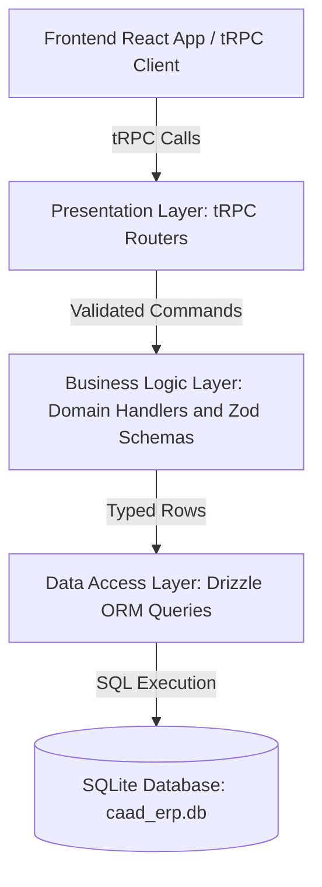

# Developer Guide

This guide captures the architecture, high-level design decisions, system
rationale, and development workflows for the CAAD ERP project. It serves as the
primary technical reference for developers maintaining or extending the
codebase.

---

## System Overview and Guiding Principles

CAAD ERP is an end-to-end full-stack TypeScript application designed for student
lounge operations, managing point-of-sale checkouts, product catalogs,
salespeople, inventory levels, credit tab tracking, and financial analytics.

The system is built around several core architectural principles:

- **Immutability and Auditability:** All financial and stock events are recorded
  in an append-only ledger. Data is never deleted or overwritten in place,
  guaranteeing a complete audit trail.
- **End-to-End Type Safety:** Strict static typing spans from database tables up
  through domain models and tRPC service procedures directly into React UI
  components and hooks without manual code generation.
- **Zero-Configuration Local Deployment:** The application runs embedded without
  external database processes, making installation, backups, and local network
  execution straightforward.
- **Pure Layering and Separation of Concerns:** Core domain rules are decoupled
  from presentation concerns and data storage drivers, keeping logic testable
  and predictable.

---

## Monorepo Architecture

The project is structured as an npm Workspaces Monorepo separating the backend
server and frontend web consumer while sharing tooling and configuration at the
root:

```text
caad-erp/
├── backend/            # Backend Workspace (Node.js + Drizzle ORM + SQLite + tRPC)
│   ├── src/
│   │   ├── dal/        # Data Access Layer (Schema definitions and SQLite queries)
│   │   ├── bll/        # Business Logic Layer (Colocated Zod schemas and domain logic)
│   │   ├── trpc/       # Presentation Layer (tRPC routers and context)
│   │   └── server.ts   # Standalone HTTP server
│   └── tests/          # Vitest suite (DAL, BLL, tRPC integration tests)
├── frontend/           # Frontend Workspace (React 19 + Vite + Mantine + React Query)
│   ├── src/            # Features (POS, Stock, Salesmen, Home), components, and hooks
│   └── package.json    # Frontend package definition
├── docs/               # Technical specifications and developer guide
├── package.json        # Root npm Workspaces orchestration and shared scripts
├── .oxlintrc.json      # Shared monorepo linting rules
├── .oxfmtrc.json      # Shared monorepo code formatting rules
└── start.bat           # Windows 1-click launch and setup script
```

---

## Architectural Rationale and High-Level Decisions

### Embedded Relational Database (SQLite + `better-sqlite3`)

The backend uses SQLite via native C++ bindings (`better-sqlite3`) rather than
an external database server like PostgreSQL or MySQL.

- **Zero-Config Execution:** Eliminates administrative overhead (no background
  database daemon, user permissions, or port configurations required).
- **Single-File Portability:** All application state is stored in a single
  portable file (`caad_erp.db`), simplifying backups and migration.
- **In-Process Performance:** Queries execute in-process with zero network
  socket latency, providing sub-millisecond execution speeds that exceed the
  requirements of local POS checkouts.

### Explicit Schema Design (Drizzle ORM)

Drizzle ORM provides lightweight, type-safe SQL query generation without runtime
abstraction overhead.

- **Boolean Type Mapping:** SQLite lacks a native boolean column type and stores
  flags as integers (`1` or `0`). Drizzle handles two-way conversion
  automatically between TypeScript booleans and SQLite integers.
- **Explicit Constraints over Fallbacks:** Non-null columns are declared without
  implicit default fallbacks. Creation functions require callers to explicitly
  supply all attributes, preventing silent data fallbacks.
- **Constrained Union Enums:** Transaction types and payment methods are
  declared as strict database string enums, enforcing valid domain values at
  compile time.

### End-to-End Contract Typing (tRPC)

The presentation layer uses tRPC (`@trpc/server` and `@trpc/react-query`) to
link backend handlers to the React frontend.

- **Compile-Time Type Sharing:** The frontend imports the backend router type
  definition directly (`import type { AppRouter } from 'caad-erp-backend'`),
  giving UI components instant autocompletion and type checking for procedure
  inputs and outputs without running build steps or OpenAPI codegen tools.
- **Automatic Error Translation:** Domain exceptions thrown in the business
  logic layer are intercepted by tRPC middleware and mapped automatically to
  semantic HTTP error statuses (such as mapping missing entities to `NOT_FOUND`
  or stock shortages to `BAD_REQUEST`).

### UI Framework and State Management (React + Mantine + React Query)

The frontend uses React 19, Vite, Mantine UI components, and TanStack React
Query.

- **Server-State Synchronization:** React Query manages caching, automatic
  refetching, and cache invalidation for catalog data and inventory balances
  upon mutation.
- **Component Ergonomics:** Mantine provides responsive layout controls,
  accessible modal forms, theme support, and notification systems designed for
  touch or desktop POS screens.

---

## Layered System Architecture

The backend follows a strict 3-layer architecture:



### Data Access Layer (DAL)

The Data Access Layer (`backend/src/dal/`) contains pure SQL query functions.
Every DAL function accepts an active database client instance as its first
argument, keeping functions stateless and side-effect-free.

### Business Logic Layer (BLL)

The Business Logic Layer (`backend/src/bll/`) encapsulates business rules,
analytics calculations, and validation logic.

- **Two-Tier Validation Strategy:** Validation is split into two complementary
  phases:
  - _Stateless Boundary Validation:_ Zod schemas validate structural types,
    string length, and numeric bounds synchronously before reaching domain
    handlers.
  - _Stateful Invariant Enforcement:_ Domain handlers enforce database-dependent
    rules (such as checking stock availability, active flags, or credit line
    links).
- **Colocated Schemas and Handlers:** Validation schemas and command payload
  types are colocated directly alongside their handler functions (`products.ts`,
  `salesmen.ts`, `transactions.ts`), keeping workflow definitions concise and
  self-contained.

### Presentation Layer (tRPC Routers)

The Presentation Layer (`backend/src/trpc/`) exposes procedures for feature
modules (`products`, `salesmen`, `transactions`, `reports`). It constructs
context containing the active database client and routes validated inputs into
BLL handlers.

---

## Core Domain Workflows and Ledger Rules

### Append-Only Transaction Ledger

All inventory movements and financial events are recorded in an append-only
`transactions` table.

- **Transaction Types:**
  - `SALE`: Decreases stock and records gross revenue.
  - `RESTOCK`: Increases stock and records inventory spend.
  - `WRITE_OFF`: Decreases stock without revenue (spoilage, loss, or damage).
  - `CREDIT_PAYMENT`: Records money collected toward a prior credit sale.
  - `VOID`: Exact reversing entry referencing a negated transaction.

### Stock Availability Enforcement

Sales and write-offs strictly enforce inventory availability. The business logic
calculates dynamic stock balances by summing quantity changes across the
transaction ledger, rejecting any operation where requested items exceed on-hand
inventory. Bulk checkouts validate aggregate cart quantities across all line
items atomically before recording entries.

### Flexible Credit Tab Management

Sales recorded on credit (`paymentType = "OnCredit"`) strictly enforce zero
initial revenue (`totalRevenue = 0`). This design guarantees that cash-basis
revenue calculations (`calculateTotalRevenue`) never double-count revenue when
customer payments are collected later.

- **Zero Revenue Enforcement:** Credit sales are validated at the schema
  boundary to ensure `totalRevenue = 0`. Storing zero revenue at checkout
  prevents inflating total revenue before cash is physically received.
- **Expected Debt Calculation:** Outstanding debt analytics
  (`calculateOutstandingDebts`) derive expected debt amounts directly from
  catalog product prices (`product.sellPrice * quantity`) and subtract all
  non-voided `CREDIT_PAYMENT` entries linked to that credit sale.
- **Partial Payments and Overpayments:** Customers can make multiple partial
  payments over time via `CREDIT_PAYMENT` transactions (using `Cash`, `PIX`, or
  `Other`). Payments are recorded as received, allowing for interest or partial
  settlements.

### Reversal and Void Workflow

To correct errors without altering history, the system uses a
reversal-and-re-entry approach. A `VOID` transaction reverses a prior entry by
negating quantity, revenue, and cost deltas while referencing the target entry
ID. Voids automatically restore inventory levels or unpaid credit debt. To
prevent infinite loops, `VOID` entries themselves cannot be voided.

### Chronological UUID v7 Identifiers

Transactions use RFC 9562 UUID v7 identifiers. UUID v7 embeds a 48-bit
millisecond timestamp followed by random bits. This guarantees time-ordered
sorting in database indexes while preventing identifier collisions during rapid
concurrent checkouts.

---

## Frontend Feature Architecture and Customer Display

The frontend UI is organized into intuitive feature modules:

- **Point of Sale (POS):** Checkout screen featuring salesman selection, cart
  management, payment method selection (Cash, Credit, PIX, Other), and Mercado
  Pago PIX QR code integration.
- **Customer Display Mode (`/display`):** Dedicated customer-facing display view
  that mirrors active POS checkouts in real time, providing customer
  transparency.
- **Product Management:** Modal interfaces to register new products, update
  prices, or toggle active catalog status.
- **Salespeople Management:** Interface to manage salespeople and their active
  status.
- **Stock Management:** Inventory control view with modal workflows for restocks
  and write-offs.

---

## Testing and Quality Assurance

### Vitest Integration and Unit Test Hierarchy

All backend layers are tested using Vitest against isolated in-memory SQLite
databases (`:memory:`):

- **Data Access Tests (`backend/tests/dal/`):** Verify schema mapping, query
  execution, and database constraints.
- **Business Logic Tests (`backend/tests/bll/`):** Verify domain workflows,
  validation rules, stock limits, credit tracking, and void reversals.
- **Service Layer Tests (`backend/tests/trpc/`):** Verify procedure routing,
  input parsing, and error status code translations.

### Test Structure Standards

Test cases follow the Arrange-Act-Assert (AAA) pattern with explicit phase
comments and Given/When/Then descriptive titles to maintain test clarity.

### Unified Monorepo Tooling (Oxc)

The project uses Oxc (`oxlint` and `oxfmt`) configured at the root
(`.oxlintrc.json` and `.oxfmtrc.json`) to enforce code formatting
(`tabWidth: 4`, `semi: false`) and lint rules across all workspace packages.
