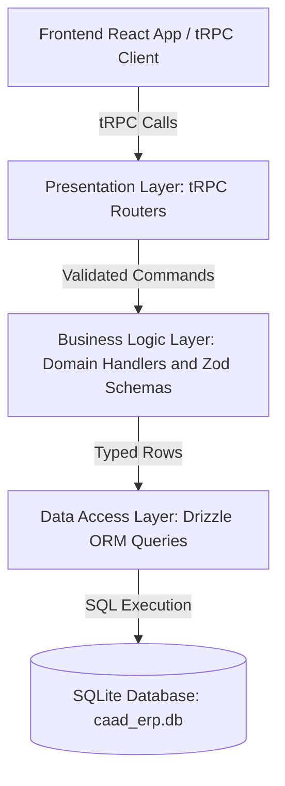

# Developer Guide

This guide captures the internal architecture decisions, design principles,
system rationale, and development workflows for the CAAD ERP project. It serves
as the primary technical reference for developers maintaining or extending the
codebase.

---

## System Overview and Guiding Principles

CAAD ERP is an end-to-end full-stack TypeScript application designed for student
lounge operations, managing point-of-sale checkouts, product catalogs,
salespeople, inventory levels, credit tab tracking, and financial analytics.

The system is built around several core architectural principles:

- **Immutability and Auditability:** All financial and stock events are recorded
  in an append-only transaction ledger. Data is never deleted or overwritten in
  place, guaranteeing a complete audit trail.
- **End-to-End Type Safety:** Strict static typing spans from database tables
  (Drizzle ORM) through service contracts (tRPC) directly into React UI
  components and hooks without manual code generation.
- **Zero-Configuration Local Deployment:** The application runs embedded without
  external database processes, making installation, backups, and local network
  execution straightforward.
- **Pure Layering and Separation of Concerns:** Core domain rules are decoupled
  from presentation concerns and data storage drivers, keeping logic testable
  and predictable.

---

## Monorepo Architecture

The project is structured as an npm Workspaces Monorepo separating the backend
server and frontend web consumer while sharing tooling and configuration at the
root:

```text
caad-erp/
├── backend/            # Backend Workspace (Node.js + Drizzle ORM + SQLite + tRPC)
│   ├── src/
│   │   ├── dal/        # Data Access Layer (Schema definitions and SQLite queries)
│   │   ├── bll/        # Business Logic Layer (Colocated Zod schemas and domain logic)
│   │   ├── trpc/       # Presentation Layer (tRPC routers and context)
│   │   └── server.ts   # Standalone HTTP server
│   └── tests/          # Vitest suite (DAL, BLL, tRPC integration tests)
├── frontend/           # Frontend Workspace (React 19 + Vite + Mantine + React Query)
│   ├── src/            # Features (POS, Stock, Salesmen, Home), components, and hooks
│   └── package.json    # Frontend package definition
├── docs/               # Technical specifications and developer guide
├── package.json        # Root npm Workspaces orchestration and shared scripts
├── .oxlintrc.json      # Shared monorepo linting rules
├── .oxfmtrc.json      # Shared monorepo code formatting rules
└── start.bat           # Windows 1-click launch and setup script
```

---

## Architectural Rationale and High-Level Decisions

### Embedded Relational Database (SQLite + `better-sqlite3`)

The backend uses SQLite via native C++ bindings (`better-sqlite3`) rather than
an external database server like PostgreSQL or MySQL.

- **Zero-Config Execution:** Eliminates administrative overhead (no background
  database daemon, user permissions, or port configurations required).
- **Single-File Portability:** All application state is stored in a single
  portable file (`caad_erp.db`), simplifying backups and migration.

### Explicit Schema Design (Drizzle ORM)

Drizzle ORM provides lightweight, type-safe SQL query generation without runtime
abstraction overhead.

- **Explicit Constraints over Fallbacks:** Non-null columns are declared without
  implicit default fallbacks. Creation functions require callers to explicitly
  supply all attributes, preventing silent data fallbacks.

### End-to-End Contract Typing (tRPC)

The presentation layer uses tRPC (`@trpc/server` and `@trpc/react-query`) to
link backend handlers to the React frontend.

- **Compile-Time Type Sharing:** The frontend imports the backend router type
  definition directly (`import type { AppRouter } from 'caad-erp-backend'`),
  giving UI components instant autocompletion and type checking for procedure
  inputs and outputs without running build steps or OpenAPI codegen tools.
- **Automatic Error Translation:** Domain exceptions thrown in the business
  logic layer are intercepted by tRPC middleware and mapped automatically to
  semantic HTTP error statuses (such as mapping missing entities to `NOT_FOUND`
  or stock shortages to `BAD_REQUEST`).

### UI Framework and State Management (React + Mantine + React Query)

The frontend uses React 19, Vite, Mantine UI components, and TanStack React
Query.

- **Server-State Synchronization:** React Query manages caching, automatic
  refetching, and cache invalidation for catalog data and inventory balances
  upon mutation.
- **Component Ergonomics:** Mantine provides responsive layout controls,
  accessible modal forms, theme support, and notification systems designed for
  touch or desktop POS screens.

---

## Layered System Architecture

The backend follows a 3-layer architecture:



### Data Access Layer (DAL)

The Data Access Layer (`backend/src/dal/`) contains pure SQL query functions.
Every DAL function accepts an active database client instance as its first
argument, keeping functions stateless and side-effect-free.

### Business Logic Layer (BLL)

The Business Logic Layer (`backend/src/bll/`) encapsulates business rules,
analytics calculations, and validation logic.

- **Two-Tier Validation Strategy:** Validation is split into two complementary
  phases:
  - _Stateless Boundary Validation:_ Zod schemas validate structural types,
    string length, and numeric bounds synchronously before reaching domain
    handlers.
  - _Stateful Invariant Enforcement:_ Domain handlers enforce database-dependent
    rules (such as checking stock availability, active flags, or credit line
    links).

### Presentation Layer (tRPC Routers)

The Presentation Layer (`backend/src/trpc/`) exposes procedures for feature
modules (`products`, `salesmen`, `transactions`, `reports`). It constructs
context containing the active database client and routes validated inputs into
BLL handlers.

---

## Data Model and Column Representation Conventions

### Relational Tables

- **`products` Table:** Stores catalog items with `product_id` (text primary
  key), `product_name`, `sell_price` (integer cents), and `is_active` (boolean
  flag).
- **`salesmen` Table:** Stores sales staff with `salesman_id` (text primary
  key), `salesman_name`, and `is_active` (boolean flag).
- **`transactions` Table:** Append-only ledger recording `transaction_id`,
  `timestamp_iso`, `transaction_type`, `product_id`, `salesman_id`,
  `payment_type`, `quantity_change`, `total_revenue`, `total_cost`,
  `linked_transaction_id`, and `notes`.

### Data Representation Conventions

- **Monetary Values as Integer Cents:** All monetary fields (`sellPrice`,
  `totalRevenue`, `totalCost`) are stored as integers representing cents (e.g.
  $5.50 = `550`). This avoids floating-point rounding errors during financial
  summations.
- **Separate Revenue and Cost Columns:** `totalRevenue` tracks gross money
  received (positive number), while `totalCost` tracks inventory spend (stored
  as a negative number). Using separate columns keeps financial calculations
  straightforward:
  - Gross Revenue: `SUM(total_revenue)`
  - Total Inventory Cost: `SUM(total_cost)`
  - Net Profit: `SUM(total_revenue) + SUM(total_cost)`
- **Dynamic Stock Level Calculation:** On-hand inventory stock is derived
  dynamically via `SUM(quantity_change)` across the transaction ledger rather
  than maintaining mutable stock counters.
- **Catalog Sell Price Purpose:** `sellPrice` in the product catalog is a
  suggested default price for UI convenience and debt calculation. The actual
  money collected for any transaction is captured explicitly in `totalRevenue`.
- **Foreign Keys and Reversal Links:** `productId` and `salesmanId` enforce
  relational consistency. `linkedTransactionId` connects credit payments back to
  their original sale and connects void entries to the transaction they reverse.

---

## Core Domain Workflows and Ledger Rules

### Append-Only Immutability

Transactions are **never deleted or updated**. Reversals use the **Reversal and
Re-entry** method by appending a `VOID` transaction that flips quantity,
revenue, and cost deltas.

### Transaction Types

- `SALE`: Reduces stock (negative quantity change) and logs revenue.
- `RESTOCK`: Increases stock (positive quantity change) and records inventory
  spend (negative total cost).
- `WRITE_OFF`: Reduces stock without revenue (spoilage, loss, damage, or
  donations).
- `CREDIT_PAYMENT`: Captures payment received for an earlier credit sale.
- `VOID`: Exact reversing entry linked to the target transaction being negated.

### Discounts and Custom Price Overrides Workflow

Discounts and custom pricing are handled flexibly during cash, PIX, or other
immediate-payment checkouts by allowing any `totalRevenue` amount to be
specified on the `SALE` entry, even if it differs from the product catalog's
default `sellPrice`. For example, selling a
$5.50 catalog item at a discounted rate of $4.00 records `totalRevenue = 400` on
the transaction.

### Inventory Write-Offs, Spoilage, Damage, and Donations Workflow

Items that leave inventory without generating immediate revenue (such as spoiled
goods, damaged stock, lost inventory, or lounge event donations) are recorded
via `WRITE_OFF` transactions (`recordWriteOff`).

- **Inventory Effect:** Reduces on-hand stock (`quantityChange` is negative).
- **Financial Effect:** Both `totalRevenue` and `totalCost` are recorded as `0`.
- **Audit Traceability:** Optional `notes` explain the business reason (e.g.
  "Donated to student event", "Expired item", "Damaged in transport").

### Restocks and Inventory Purchasing Workflow

Restocks are logged via `RESTOCK` transactions (`recordRestock`).

- **Inventory Effect:** Increases available stock (`quantityChange` is
  positive).
- **Financial Effect:** Records total inventory purchase cost in `totalCost`
  (stored as a negative integer representing cents). `totalRevenue` is recorded
  as `0`.
- **Zero-Cost Restocks (`totalCost = 0`):** Initial purchase cost can be zero
  (`totalCost = 0`) for donated stock (such as alumni or sponsor donations),
  vendor promotional samples, or zero-cost inventory adjustments. Zero-cost
  restocks increase available inventory without incurring cash expense, allowing
  subsequent sales of donated items to contribute 100% of their revenue directly
  to net profit.

### Bulk Sales and Atomic Cart Checkout Workflow

Bulk sales capture shopping cart checkouts where a customer purchases multiple
items in a single transaction. The workflow operates in two phases:

- **Validation Phase:** Validates every sale item in the cart (product
  existence, active status, salesman active status, positive quantities, stock
  availability). If any item fails validation, the operation aborts immediately
  and zero entries are recorded.
- **Execution Phase:** Appends all sale transactions to the ledger in sequence
  within a single atomic database context pass.

### Flexible Credit Tab Management Workflow

- **Zero Revenue Enforcement:** Credit sales are validated at the schema
  boundary to ensure `totalRevenue = 0`. Storing zero revenue at checkout allows
  to know which type of payment was actually made. Partial payments on sale
  (followed by other on credit payments) can be recorded as sequential SALE and
  CREDIT_PAYMENT transactions.
- **Expected Debt Calculation:** Outstanding debt analytics
  (`calculateOutstandingDebts`) derive expected debt amounts directly from
  catalog product prices (`product.sellPrice * quantity`) and subtract all
  non-voided `CREDIT_PAYMENT` entries linked to that credit sale.
- **Partial Payments and Overpayments:** Customers can make multiple partial
  payments over time via `CREDIT_PAYMENT` transactions (using `Cash`, `PIX`, or
  `Other`). Payments are recorded as received, allowing for interest or partial
  settlements.

### Error Correction and Voiding Workflow

A `VOID` transaction reverses an entry by negating quantity, revenue, and cost
deltas while referencing the target transaction ID.

`VOID` entries themselves cannot be voided, preventing infinite reversal loops.

### Product Catalog Price Changes and Historical Ledger Independence Workflow

Updating a product's default catalog `sellPrice` (for example, increasing an
item's price from $5.00 to $6.00 via `updateProduct`) updates the suggested
default price for future checkouts and new credit tab calculations.

- **Historical Ledger Immutability:** Existing `SALE` entries in the append-only
  ledger retain their original `totalRevenue` (e.g. $5.00). Historical revenue,
  cost, and net profit calculations reflect actual past transactions without
  being retroactively altered by catalog price updates.
- **Credit Tab Calculations and Operational Caveat:** Outstanding debt
  calculations (`calculateOutstandingDebts`) evaluate credit sales using the
  current catalog `sellPrice` of the product. Developers and lounge managers
  must exercise care when updating catalog prices: if a credit sale was recorded
  when a product cost $5.00 and the customer paid $5.00, increasing the catalog
  `sellPrice` to
  $6.00 later will cause `calculateOutstandingDebts` to compute expected debt as $6.00
  and report a pending balance of $1.00 even though the debt was previously
  satisfied.

---

## Detailed Rationale and System Decisions (Q&A)

### Why use UUID v7 for Transaction IDs instead of Auto-Incrementing Integers?

Transaction records use RFC 9562 UUID v7 string identifiers (`uuidv7()`)
generated in the application layer instead of database auto-incrementing integer
IDs (`1, 2, 3...`).

- **Time-Ordered Index Locality:** UUID v7 embeds a 48-bit millisecond UTC
  timestamp followed by 74 random bits. In SQLite B-tree indexes, UUID v7
  entries sort naturally in chronological order just like auto-incrementing
  integers, maintaining high index insertion performance.
- **Collision-Free Application Generation:** UUID v7 identifiers can be
  generated safely in application memory or client transactions before hitting
  the database, avoiding sequential database lock contention or ID allocation
  bottlenecks during concurrent operations or batch checkouts.

### Why Hard-Code PaymentType as an Enum?

The list of payment types (`Cash`, `OnCredit`, `PIX`, `Other`) is hard-coded as
a TypeScript enum rather than stored in a user-editable configuration table.

- **Business Criticality:** `"OnCredit"` is a fundamental business rule that
  triggers specific debt calculation workflows rather than mere display data.
- **User Error Prevention:** Hard-coding the enum prevents accidental deletion
  or renaming of critical credit payment values, ensuring the credit tab
  tracking system remains 100% reliable.

### Soft-Delete vs Hard-Delete Rationale

To "remove" an item (product or salesman), the system performs a **soft-delete**
by toggling `isActive = false` in the database table.

- **The Hard-Delete Disaster (Avoided):** If a product row were permanently
  deleted from the database, all historical transaction records referencing that
  `product_id` would become orphaned. Running historical financial or sales
  reports would fail or return corrupted data.
- **The Soft-Delete Solution:** Setting `isActive = false` hides the product
  from active sales and inventory selection views while preserving its
  historical record. Past reports can still look up the product name and
  accurately compute historical revenue and profit.

### Unfiltered Catalog Queries Rationale

The business logic helpers (`listProducts`, `listSalesmen`) and tRPC procedures
return the full catalog dataset (including inactive items) without server-side
filtering.

- **Low Data Volume:** Product and salesman catalogs stay relatively small
  (dozens to low hundreds of items), so server-side active filtering adds API
  complexity without measurable performance benefit.
- **Client Flexibility:** Returning the full dataset allows frontend UI screens
  to filter active items for checkout screens while showing full management
  lists (with active status toggles) on administrative screens.

---

## Frontend Feature Architecture and Customer Display

The frontend UI is organized into feature modules:

- **Point of Sale (POS):** Checkout screen featuring salesman selection, cart
  management, payment method selection (Cash, Credit, PIX, Other), and Mercado
  Pago PIX QR code integration.
- **Customer Display Mode (`/display`):** Dedicated customer-facing display view
  that mirrors active POS checkouts in real time, providing customer
  transparency.
- **Product Management:** Modal interfaces to register new products, update
  prices, or toggle active catalog status.
- **Salespeople Management:** Interface to manage salespeople and their active
  status.
- **Stock Management:** Inventory control view with modal workflows for restocks
  and write-offs.

---

## Testing and Quality Assurance

### Vitest Integration and Unit Test Hierarchy

All backend layers are tested using Vitest against isolated in-memory SQLite
databases (`:memory:`):

- **Data Access Tests (`backend/tests/dal/`):** Verify schema mapping, query
  execution, and database constraints.
- **Business Logic Tests (`backend/tests/bll/`):** Verify domain workflows,
  validation rules, stock limits, credit tracking, and void reversals.
- **Service Layer Tests (`backend/tests/trpc/`):** Verify procedure routing,
  input parsing, and error status code translations.

### Test Structure Standards

Test cases follow:

- **Arrange-Act-Assert (AAA) Pattern:** Test bodies are divided by phase
  comments (`// Arrange`, `// Act`, `// Assert`) for readability.
- **Given/When/Then (GWT) Titles:** Test descriptions use GWT titles (e.g.
  `GIVEN an OnCredit sale WHEN recordCreditPayment is called THEN...`) to
  document intent.

### Unified Monorepo Tooling (Oxc)

The project uses Oxc (`oxlint` and `oxfmt`) configured at the root
(`.oxlintrc.json` and `.oxfmtrc.json`) to enforce code formatting
(`tabWidth: 4`, `semi: false`) and lint rules across all workspace packages.
